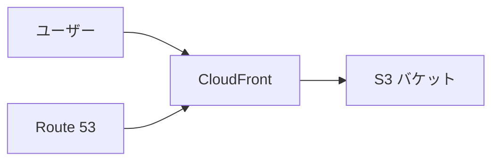

# 基本設計書

## システム概要

数字記憶ゲームは、表示された数字を記憶し、入力するシンプルなブラウザゲームです。

## アーキテクチャ

### インフラストラクチャ
- フロントエンド: S3でホスティング
- CDN: CloudFrontによる配信
- DNS: Route 53による名前解決
- SSL: ACMによる証明書管理

### フロントエンド構成
- Next.js（Static Export）
- コンポーネント設計
  - アトミックデザインの採用
  - 再利用可能なUIコンポーネント

## ゲームロジック

### ゲームフロー
1. 数字の表示（レベルに応じた桁数）
2. カウントダウンタイマー
3. 入力フェーズ
4. 結果判定
5. スコア計算

### レベルデザイン
- 初期レベル: 3桁
- レベルアップ: +1桁
- 表示時間: レベル + 2秒

### スコアリング
- 基本点: レベル × 100点
- ハイスコア: ローカルストレージに保存

## セキュリティ考慮事項

### フロントエンド
- HTTPSの強制
- Content Security Policyの設定
- クロスサイトスクリプティング対策

### インフラストラクチャ
- S3バケットの非公開設定
- CloudFrontによるアクセス制御
- 適切なIAMポリシーの設定

## 将来の拡張性

### 機能追加候補
- ユーザー認証
- オンラインランキング
- 複数のゲームモード
- スマートフォンアプリ化

### 技術的な拡張
- バックエンドAPIの追加
- データベースの導入
- リアルタイム機能の実装 